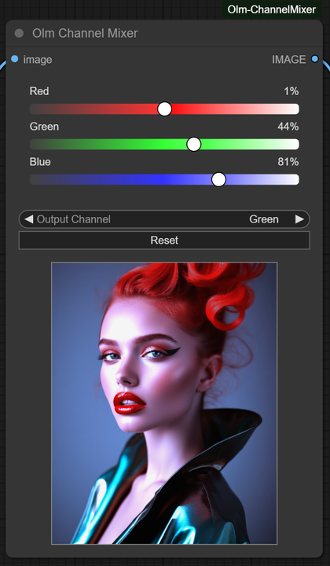

# Olm Channel Mixer for ComfyUI



An interactive, classic **channel mixer** color adjustment node for ComfyUI, with realtime preview and a responsive editing interface.

- **Author:** Olli Sorjonen
- **GitHub:** https://github.com/o-l-l-i
- **X:** https://x.com/Olmirad
- **Version:** 1.0.1 (preview fixes)

---

## ✨ What Is This?

**Olm Channel Mixer** is a recreation of the classic **channel mixer** color adjustment effect — built as a fully interactive node for ComfyUI.

This tool gives you precise control over how each RGB output channel is composed from the input image’s RGB components. All adjustments are applied in realtime with a built-in preview, so you can see your changes instantly — no re-running the graph required.

Use it for:

- Creative color mixing and channel remapping.
- Cinematic and stylized grading.
- Emulating analog color effects.

**A few example adjustments:**


---

## 🎯 Why Use This Tool?

- 🧩 **Standalone & Lightweight**
  - Not part of a node suite.
  - Depends only on `Pillow`, `Torch`, and `NumPy`.

- 🖼️ **Adobe-Like Channel Mixer**
  - Mimics Adobe-style Channel Mixer with closely matched logic.
  - Offers full RGB channel control via intuitive sliders:

    | Output Channel   | Sliders Available                                   |
    |------------------|-----------------------------------------------------|
    | **Red Output**   | Red from Red, Green from Red, Blue from Red         |
    | **Green Output** | Red from Green, Green from Green, Blue from Green   |
    | **Blue Output**  | Red from Blue, Green from Blue, Blue from Blue      |

- 🧘 **Clean, Responsive UI**
  - Fully resizable and scalable.
  - Sliders scale with the node for precision tweaks.
  - Live preview updates instantly without needing to rerun the graph.
  - Great for experimentation and fine-tuning looks.

---

## 📦 Installation

Clone this repository into your `custom_nodes` folder.

```bash
git clone https://github.com/o-l-l-i/ComfyUI-Olm-ChannelMixer.git
```

Your folder structure should look like this:

```bash
ComfyUI/
└── custom_nodes/
    └── ComfyUI-Olm-ChannelMixer/
        ├── __init__.py
        ├── olm_channelmixer.py
        └── ... (other files)
```

Restart ComfyUI to load the node.

✅ No additional dependencies needed — works out of the box.

---

## 🧪 Basic Usage
1. Load an image using the Load Image node.
2. Connect it to Olm Channel Mixer.
3. Run the graph once to generate a preview image from the connected upstream source.
5. Adjust the sliders:
6. Tune each output channel by adjusting how much red, green, and blue it receives.
7. Preview the result in the node's built-in image thumbnail, no need to re-run the graph.
8. Pipe the output to any other ComfyUI node which accepts Image type.

You only need to execute the graph once - from there, everything updates live.

---

## Tips

- Channel Mixer type effect is often more effective when used in combination with other nodes, such as color curves or typical image adjustments like contrast, gamma, brightness, etc.
- My nodes such as **Olm Curve Editor** and **Olm Image Adjust** make an effective combination with this node.
  - https://github.com/o-l-l-i/ComfyUI-Olm-CurveEditor
  - https://github.com/o-l-l-i/ComfyUI-Olm-ImageAdjust

---

## ⚠️ Known Limitations

- Preview only activates after the graph is run once (this is a Comfy UI/LiteGraph technical limitation.)
- Currently limited to RGB image inputs.
- No mask support/pass-through.
- Performance is generally fast, but scales with image size.

---

## 💬 Notes

This node is part of my ongoing series of minimal, clean utility nodes for ComfyUI.
It’s experimental and under active development - breaking changes may occur.
Please open an issue if you find something broken.

And send feedback and suggestions if you feel something could be improved, but I can't promise quick responses and changes.


---

## License & Usage Terms

Copyright (c) 2025 Olli Sorjonen

This project is source-available, but not open-source under a standard open-source license, and not freeware.
You may use and experiment with it freely, and any results you create with it are yours to use however you like.

However:

Redistribution, resale, rebranding, or claiming authorship of this code or extension is strictly prohibited without explicit written permission.

Use at your own risk. No warranties or guarantees are provided.

The only official repository for this project is: 👉 https://github.com/o-l-l-i/ComfyUI-Olm-ChannelMixer

---

## Author

Created by [@o-l-l-i](https://github.com/o-l-l-i)